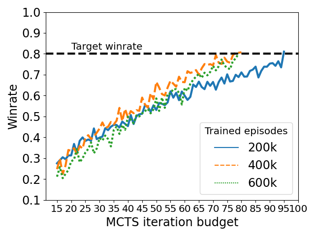

# BRExIt: On Opponent Modelling in Expert Iteration

Best Response Expert Iteration (BRExIt) a more sample efficient enhancement on Expert Iteration (ExIt), which uses opponent modelling to bias its MCTS and shape the features of the apprentice's neural network features.


## Overview

This repository contains information about the IJCAI 2023 submission **BRExIt: On Opponent Modelling in Expert Iteration**. This repository contains all the code, dependencies and explanation for every experiment in the publication. As a summary, it contains information about:

+ Generating test agents
+ Benchmarking these test test agents
+ Training BRExIt ablations against these
+ Visualizing results for all steps

We use the open source MARL framework [`Regym`](https://github.com/danielhp95/regym) to train both the PPO based test agents and BRExIt & ExIt agents. [`Streamlit`](https://github.com/streamlit/streamlit) is used to aggregate and display all results. [`Seaborn`](https://github.com/mwaskom/seaborn) alongside [`Pandas`](https://github.com/pandas-dev/pandas) is used to plot data. All of the images in this README can be generated via [our streamlit application](streamlit_app/view.py).

## Installation

All of the python requirements are present in [`requirements.txt`](./requirements.txt). We recommend its installation within a virtual environment.

## Generating test agents

All code relating to the generation of test agents can be found in the directory [`generate_test_agents`](generate_test_agents/) and it is based on [`Regym`](https://github.com/danielhp95/regym) standards. The configuration file used in the publication, specifying all relevant hyperparameters for both the training scheme ($\delta = 0$-Uniform self-play) and the learning algorithm (PPO) can be found [here](./generate_test_agents/generate_test_agents_config.yaml). To reproduce the generation of test agents, run the given [training script](generate_test_agents/generate_test_agents.py) with the aforementioned configuration file:

```bash
cd generate_test_agents/
python generate_test_agents --config generate_test_agents_config.yaml
```

This will create two directories. One with a name corresponding to the `experiment_id` field in the config file and another with the same name but `_logs` appended to it, containing [`tensorboard`](https://github.com/tensorflow/tensorboard) log files for lower level information on the training run. The former directory will contain checkpoints of Regym agents, with one saved checkpoint after every `save_interval` episodes as specified in the configuration file. Within this directory there is a `menagerie` directory, containing the policies used by the population-based self-play training scheme. For more details on understanding the separation between training scheme and the underlying RL algorithm we recommend [this paper](https://arxiv.org/abs/2006.04471).

## Benchmarking test agents

Once we have the a directory containing test agents, we want to benchmark two properties

1. That they feature internal monotonic improvement as they receive longer training, which will ensure that the training has been successful.
2. To benchmark the test agents against MCTS, so we can decide on different levels of difficulty when setting these test agents as opponents against the MCTS based BRExIt and ExIt agents.

(1) Can be accomplished via the script [`benchmark_agents.py`](./benchmark_test_agents/benchmark_agents.py). To run it:

```bash
cd benchmark_test_agents/
python benchmark_agents.py \
--path <path_to_trained_agents> \
--name <directory_to_save_results>
```

It creates a directory, defined by the flag `--name` which contains three files: a winrate evaluation matrix, a max-entropy Nash equilibrium for the game defined by winrate matrix and Nash averaging for the corresponding Nash equilibrium. Please refer to this [paper](https://arxiv.org/abs/1806.02643v2) for information about why this is useful for benchmarking agents. Here we present the evaluation winrate matrix and corresponding max-entropy Nash equilibrium for the test agents used in the publication:


(2) Can be accomplished by  [`benchmark_skill_against_mcts.py`](./benchmark_test_agents/benchmark_skill_against_mcts.py). It computes the MCTS equivalent strength for input agents, which determines what is the MCTS budget required by an MCTS agent to beat a given agent.

```bash
cd benchmark_test_agents/
python benchmark_skill_against_mcts.py \
--path <path_to_trained_agents> \
--winrate_threshold <desired_winrate>
```

We set the desired winrate to 80%, so that it stops once we find a budget for MCTS so that it obtains an 80% winrate against each of the input agents. The script outputs a log file logging the winrate obtained for each budget leading up to the final one. It is from these MCTS equivalent strengths that we decide on the strength label of the agents used as fixed opponent to be trained against by our BRExIt ablations. This is the MCTS equivalent strength for the test agents used in the publication:



## Training ablation from BRExIt to ExIt

All code relating to the training of agents against fixed test agents can be found in the directory [`train_against_test_agents`](train_against_test_agents/). There are many, many, many parameters to both BRExIt and ExIt, so we recommend looking at the original [Regym's source code for the algorithm](https://github.com/Danielhp95/Regym/blob/master/regym/rl_algorithms/agents/expert_iteration_agent.py) for a definition of each.

The script [train_against_test_agents.py](train_against_test_agents/train_against_test_agents.py) takes a [configuration file](train_against_test_agents/train_against_test_agents_config.yaml) which defines the configuration of each ablation, from BRExIt to ExIt, as well as experiment hyperparameters such as at what apprentice winrate against the opponent (or combination of opponents) will the experiment be considered a success.

It creates two directories, named after `experiment_id` field in the config and `experiment_id_log`. The latter directory contains tensorboard logs of the training runs. The former will contain, for each algorithm, a series of `.csv` files denoting the evolution of winrates against the specified opponents. To run the training, use the aforementioned script, and refer to script for extra comments:

```bash
cd train_against_test_agents/
python train_against_test_agents.py \
--config <path_to_config> \
--opponents_path <path_to_trained_test_agents>
--run_id <training_run_index>  \ # (OPTIONAL)
--agent_index <index_of_the_agent_to_train> # (OPTIONAL)
```

## Visualizing results

We use [`Streamlit`](https://github.com/streamlit/streamlit) to visualize results. Once we have results from having run all previous training and benchmarking scripts, we can run the script [view.py](streamlit_app/view.py) as an Streamlit application with pointers to the results. **ALTERNATIVELY** you can use the paths suggested below, containing the results from the publication's experiments.

TODO: Change / shorten path names once all training runs have finished

```bash
cd streamlit_app/
streamlit run view.py -- \
--test_agents_internal_benchmark_path ../benchmark_test_agents/test_agents_internal_benchmark \
--test_agents_mcts_strength_path ../benchmark_test_agents/test_agents_mcts_equivalent_strength \
--path_1 ../train_against_test_agents/experiment_data/vs_weak \
--path_2 ../train_against_test_agents/experiment_data/vs_medium \
--path_3 ../train_against_test_agents/experiment_data/vs_strong \
--path_1_one_hot ../train_against_test_agents/experiment_data/vs_weak_one_hot \
--path_2_one_hot ../train_against_test_agents/experiment_data/vs_medium_one_hot \
--path_3_one_hot ../train_against_test_agents/experiment_data/vs_strong_one_hot \
--path_multiple ../train_against_test_agents/experiment_data/vs_multiple \
--path_multiple_one_hot ../train_against_test_agents/experiment_data/vs_multiple_one_hot
```

### License

We follow the [CRAPL License](https://matt.might.net/articles/crapl/). Please read the file [LICENSE](LICENSE).

